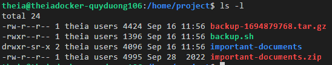

# Final Project 
## Getting Started 
### Task 0
1. Open a new terminal by clicking on the menu bar and selecting Terminal->New Terminal:

2. Download the template file backup.sh by running the command below:
```
theia@theiadocker-quyduong106:/home/project$ wget https://cf-courses-data.s3.us.cloud-object-storage.appdomain.cloud/IBM-LX0117EN-SkillsNetwork/labs/Final%20Project/backup.sh
--2023-09-16 04:56:54--  https://cf-courses-data.s3.us.cloud-object-storage.appdomain.cloud/IBM-LX0117EN-SkillsNetwork/labs/Final%20Project/backup.sh
Resolving cf-courses-data.s3.us.cloud-object-storage.appdomain.cloud (cf-courses-data.s3.us.cloud-object-storage.appdomain.cloud)... 169.63.118.104
Connecting to cf-courses-data.s3.us.cloud-object-storage.appdomain.cloud (cf-courses-data.s3.us.cloud-object-storage.appdomain.cloud)|169.63.118.104|:443... connected.
HTTP request sent, awaiting response... 200 OK
Length: 1071 (1.0K) [text/x-sh]
Saving to: ‘backup.sh’

backup.sh                       100%[====================================================>]   1.05K  --.-KB/s    in 0s      

2023-09-16 04:56:54 (95.0 MB/s) - ‘backup.sh’ saved [1071/1071]
```

3. About the template script backup.sh
4. Saving your progress
```
Unfortunately, our editor does not currently support file uploading, so you will need to copy and paste your work as follows:

To "upload" your in-progress backup.sh file and continue working on it:
Open a terminal and type touch backup.sh
Open the empty backup.sh file in the editor
Copy-paste the contents of your locally-saved backup.sh file into the empty backup.sh file in the editor 

theia@theiadocker-quyduong106:/home/project$ touch backup.sh
```

# Task 1
Set two variables equal to the values of the first and second command line arguments, as follows:

Set targetDirectory to the first command line argument Set destinationDirectory to the second command line argument This task is meant to help with code readability.
```

```

# Task 2
```

```

# Task 3
```

```

# Task 4
```

```

# Task 5
```

```

# Task 6
```

```

# Task 7 
```

```

# Task 8 
```

```

# NOTE ON ARRASY
```

```
# Task 9 
```

```

# Task 10 
```

```

# Task 11
```

```

# Task 12
```

```

# Task 13
```

```
# Task 14
```
Open a new terminal by clicking on the menu bar and selecting Terminal->New Terminal, as in the image below:

```

# Task 15
```
theia@theiadocker-quyduong106:/home/project$ ls
backup.sh
theia@theiadocker-quyduong106:/home/project$ ls -l backup.sh 
-rw-r--r-- 1 theia users 1420 Sep 16 11:37 backup.sh
theia@theiadocker-quyduong106:/home/project$ chmod u+x backup.sh 
theia@theiadocker-quyduong106:/home/project$ ls -l backup.sh 
-rwxr--r-- 1 theia users 1420 Sep 16 11:37 backup.sh
theia@theiadocker-quyduong106:/home/project$ 
```

# Task 16
```
theia@theiadocker-quyduong106:/home/project$ wget https://cf-courses-data.s3.us.cloud-object-storage.appdomain.cloud/IBM-LX0117EN-SkillsNetwork/labs/Final%20Project/important-documents.zip
--2023-09-16 11:40:31--  https://cf-courses-data.s3.us.cloud-object-storage.appdomain.cloud/IBM-LX0117EN-SkillsNetwork/labs/Final%20Project/important-documents.zip
Resolving cf-courses-data.s3.us.cloud-object-storage.appdomain.cloud (cf-courses-data.s3.us.cloud-object-storage.appdomain.cloud)... 169.63.118.104
Connecting to cf-courses-data.s3.us.cloud-object-storage.appdomain.cloud (cf-courses-data.s3.us.cloud-object-storage.appdomain.cloud)|169.63.118.104|:443... connected.
HTTP request sent, awaiting response... 200 OK
Length: 4995 (4.9K) [application/zip]
Saving to: ‘important-documents.zip’

important-documents.zip         100%[====================================================>]   4.88K  --.-KB/s    in 0s      

2023-09-16 11:40:31 (608 MB/s) - ‘important-documents.zip’ saved [4995/4995]

theia@theiadocker-quyduong106:/home/project$ unzip -DDo important-documents.zip
Archive:  important-documents.zip
   creating: important-documents/
  inflating: important-documents/zop.txt  
  inflating: important-documents/ana.txt  
  inflating: important-documents/doi.txt  
theia@theiadocker-quyduong106:/home/project$ touch important-documents/*
theia@theiadocker-quyduong106:/home/project$ date -r important-documents
Sat Sep 16 11:46:11 EDT 2023
theia@theiadocker-quyduong106:/home/project$ ./backup.sh important-documents .
Target Directory is important-documents
Destination Directory is .
ana.txt
doi.txt
zop.txt

```

# Task 17
```
theia@theiadocker-quyduong106:/home/project$ sudo cp backup.sh /usr/local/bin/
theia@theiadocker-quyduong106:/home/project$ crontab -e
no crontab for theia - using an empty one
crontab: installing new crontab
theia@theiadocker-quyduong106:/home/project$ sudo service cron start
 * Starting periodic command scheduler cron
   ...done.
theia@theiadocker-quyduong106:/home/project$ cd /home/project
theia@theiadocker-quyduong106:/home/project$ ls -l *.tar.gz
-rw-r--r-- 1 theia users 4424 Sep 16 11:56 backup-1694879768.tar.gz
theia@theiadocker-quyduong106:/home/project$ sudo service cron stop
 * Stopping periodic command scheduler cron
   ...done.

```